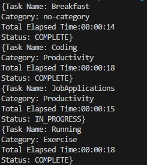
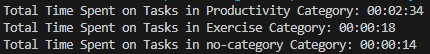

# Time Tracker App

## Usage

### Start logging time
`time-tracker start <task-name>`

    - Starts a new task with the given name and begins tracking elapsed time on this task
`time-tracker start <task-name> <category-name>`

    - Starts a new task with the given name and category and begins tracking elapsed time on this task
Notes: 
- Tasks are identified by task name, so attempting to start a new task with the same name as another will cause the existing task with the given name to be started once more, and no new task created.
- Starting a new task automatically stops any tasks currently in progress, so only one task is being worked on and tracked at a time.

### Stop logging time
`time-tracker stop <task-name>`

### Display current logged times
`time-tracker report tasks`

    - Shows all current tasks and their associated time elapsed

`time-tracker report category`

    - Shows all the current categories and their associated time elapsed

## Example Output
### After Running First Set of Commands:
1. `time-tracker start Breakfast`
2. `time-tracker stop Breakfast` 
3. `time-tracker start Coding Productivity`
4. `time-tracker start Running Exercise`
5. `time-tracker stop Running`
6. `time-tracker start JobApplications Productivity`
7. `time-tracker report tasks`

### Output:

### After Running Second Set of Commands:
1. `time-tracker stop JobApplications`
1. `time-tracker report category`

### Output:
